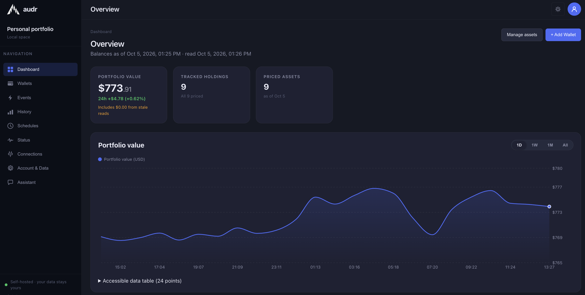

<p align="center">
  <picture>
    <source media="(prefers-color-scheme: dark)" srcset="assets/brand/audr-logo-dark-512.png">
    <source media="(prefers-color-scheme: light)" srcset="assets/brand/audr-logo-light-512.png">
    
  </picture>
</p>

<p align="center">
  <a href="https://github.com/br3d/audr/actions/workflows/tests.yml"></a>
  <a href="https://github.com/br3d/audr/tags"></a>
  <a href="https://github.com/br3d/audr/pkgs/container/audr-backend"></a>
  <a href="LICENSE"></a>
</p>

# audr

**A self-hosted Ethereum portfolio tracker: point it at the public addresses you
own and see what they hold and what it is worth — without ever giving it a
private key.**

<p align="center">
  
</p>

<p align="center">
  <em>The dashboard overview. <strong>Demonstration data</strong> — the figures
  in this capture are from a test instance, not a real portfolio.</em>
</p>

---

## What you get

- **Many addresses, one portfolio.** Add any number of public Ethereum mainnet
  addresses and see them as a single total, plus per-asset allocation.
- **ETH and ERC-20 balances over plain JSON-RPC.** No proprietary indexer and no
  portfolio API in the middle — a public endpoint works out of the box, your own
  Infura/Alchemy node is an upgrade.
- **USD valuation** out of the box — prices come from CoinMarketCap's public
  endpoints, which need no account or API key — refreshed on a schedule you
  control. A free CoinGecko Demo API key is the optional upgrade for wider token
  coverage; those two are the only price sources audr supports.
- **Value history** charted from the moment you add an address onward.
- **Honest numbers.** A failed read says *failed*, a stale balance says *stale*
  and shows when it last succeeded, and token coverage is stated rather than
  implied. Nothing is zero-filled to look complete.
- **Background scans you can see and steer** — balance scans, token discovery,
  quotes and icons each run on an owner-configurable schedule that you can
  pause, retrigger and inspect.

It never asks for a private key or seed phrase, never signs or submits a
transaction, and has no multi-user mode.

---

## Install

Requires Docker Engine 26+ with Compose v2, and `openssl`.

```bash
git clone https://github.com/br3d/audr.git && cd audr

bash scripts/setup-secrets.sh     # generates .env and secrets/ — idempotent
docker compose up -d              # pulls ghcr.io/br3d/audr-backend + postgres:16-alpine
```

Then open <http://localhost/>, set the owner password (12–128 characters) and add
an address. Balances and USD prices start arriving without any further setup:
audr reads the chain through the public `ethereum-rpc.publicnode.com` endpoint
and prices holdings through CoinMarketCap's public API, neither of which needs an
account or an API key. Both are shown, with the source actually in use, under
**Connections** — where you can point audr at your own node (any JSON-RPC URL)
for higher rate limits, or switch the price source to CoinGecko's Demo API with
a free key for wider token coverage. CoinMarketCap and CoinGecko are the only
price providers audr can use; supporting another one takes a code change, not a
setting.
Addresses and scan schedules live in the web interface too; routine operation
needs no file editing and no shell.

**One thing is easier to decide now than later: whether the database volume sits
on an encrypted disk.** Addresses, holdings and the value history are plaintext
at the column level, so that volume is what protects them — and moving it onto
an encrypted mount after Postgres has written to it is a dump-and-restore, not a
setting. If this machine is a laptop, a NAS, or anything whose disk might outlive
your control of it, set that up before the `up -d` above:
[encrypting the database volume](docs/operations.md#encrypting-the-database-volume).

If port 80 is taken, set `AUDR_HTTP_PORT=8080` in `.env`. Only HTTP is served, so
put a TLS-terminating reverse proxy in front of it before exposing it beyond
localhost — see [operations.md](docs/operations.md#tls--https-proxy).

---

## Limits

- **Ethereum mainnet only.** No other EVM chain, no non-EVM chain.
- **Native ETH and ERC-20 tokens only.** No NFT valuation.
- **History starts when you add the address.** Earlier periods are not
  backfilled, and PnL and cost basis are not computed.
- **No DeFi position decomposition** — LP, staking and lending positions are not
  broken out.
- Addresses, balances and history are stored unencrypted at the column level;
  provider credentials and wallet labels are encrypted. Threat model:
  [security-at-rest.md](docs/security-at-rest.md).

News, AI recommendations and address-security monitoring are *not* in this
release — they are proposals in the [roadmap](docs/roadmap.md).

---

## Next steps

| | |
|---|---|
| **Update your install** | `git pull && docker compose pull && docker compose up -d`. Versioning and what each bump implies: [releases.md](docs/releases.md) |
| **Back up** | Your `secrets/master_key.hex` is **not recoverable** — back it up. Database backup and restore: [operations.md](docs/operations.md#backups) |
| **Operate** | Secrets, TLS, key loss, exports, data purge, reset, troubleshooting: [operations.md](docs/operations.md) |
| **Read the docs** | [docs/README.md](docs/README.md) — the full index, grouped by what you are trying to do |
| **Contribute** | [CONTRIBUTING.md](CONTRIBUTING.md) — setup, the mandatory gates, and how to send a patch |
| **Report a vulnerability** | Privately, via [SECURITY.md](SECURITY.md). Please do not open a public issue |

Licensed under the GNU General Public License v3.0 — see [LICENSE](LICENSE).
Third-party attribution and pinned versions: [third-party.md](docs/third-party.md).
