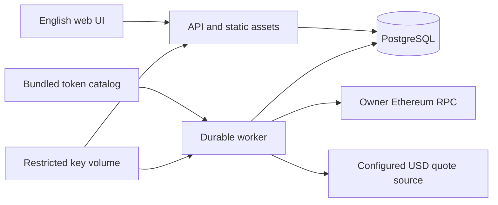

# Implementation Plan: Ethereum Portfolio

**Branch**: No Git branch created; feature identifier `001-ethereum-portfolio`.
**Date**: 2026-09-25 | **Spec**: [spec.md](spec.md)

**Input**: Feature specification from `specs/001-ethereum-portfolio/spec.md`.

## Summary

Build a Docker Compose deployment for one owner to configure Ethereum mainnet access,
discover ETH/ERC-20 holdings through RPC, see USD allocation and preserve observed history.
Use a modular Python API/worker application, PostgreSQL persistence and a React SPA.
A bundled catalog plus manual contracts provides discovery; CoinGecko Demo supplies optional
USD quotes. All routine product settings live in the English web UI.

This is the technical design phase. No application, Docker deployment or live integration
has been implemented. [Research](research.md) records sources, alternatives and limits.

## Technical Context

**Language/Version**: Python 3.14; TypeScript; Node 24 for building the SPA.
**Primary Dependencies**: FastAPI, SQLAlchemy 2.0, Alembic, psycopg 3, HTTPX,
eth-utils/eth-abi, cryptography, argon2-cffi; React 19, Vite 8, TanStack Query,
Recharts and decimal.js. Pin exact compatible versions and image digests during implementation.
**Storage**: PostgreSQL 18; persistent DB volume and separate master-key volume.
**Testing**: pytest and controlled RPC/quote fixtures; Vitest; Playwright; actual PostgreSQL
integration tests and Docker Compose restart scenarios.
**Target Platform**: Linux containers, amd64 baseline and arm64 build compatibility.
**Project Type**: Web application with one API service and one worker from the same image.
**Performance Goals**: SC-004 p95 <=3s for warm dashboard/history reads, measured on the
reference fixture; external discovery/scan duration is reported independently.
**Constraints**: One owner; read-only Ethereum mainnet; native ETH/ERC-20; USD; English;
no live indexer requirement; bounded provider use; no private keys, news, AI or alerts in R1.
**Scale/Scope**: Reference 50 wallets, 100 asset identities, 500 held pairs, one year hourly
history on 4 vCPU/8 GiB Linux with SSD. This is a benchmark, not a wallet-count restriction.

## Constitution Check

Pre-research review: all seven gates are compatible with the specification; provider,
storage and recovery decisions require evidence. Post-design review:

| Principle | Outcome | Design evidence |
|-----------|---------|-----------------|
| I. Owner control | PASS at design level | Local DB, web settings, encrypted credentials and quote payloads, private exports and persistent key storage; external disclosures in UI contract |
| II. Read-only | PASS | Explicit RPC read adapter; no transaction/signature routes or wallet SDK connection |
| III. Accounting/coverage | PASS | uint256/Decimal, string serialization, catalog coverage, pinned balance blocks, immutable snapshot provenance and invalidation |
| IV. AI evidence | Not applicable to R1 | No AI/news adapter or calls; later release retains constitutional obligations |
| V. Background work | PASS | Durable jobs, leases, bounded retry/budgets, editable schedules, progress and freshness |
| VI. Replaceability | PASS | Distinct RPC/catalog/quote interfaces; bundled candidates; single database/worker; no SaaS infrastructure |
| VII. Verification | PASS at design level | FR/SC mapping, required fixture/browser/restart checks, English artifacts and versioned migrations |

No constitutional exceptions. PASS describes design coverage, not passing implementation tests.

## Architecture and responsibilities



- `auth`: singleton setup, password/session lifecycle and request protection.
- `settings`: encrypted integrations, schedules, budgets, capability checks.
- `wallets/assets`: identities, labels, tracking membership, manual tokens and exclusions.
- `providers`: explicit read-only RPC, validated catalog and CoinGecko adapter contracts.
- `jobs`: PostgreSQL scheduler/leases, checkpoints, cost counters and worker heartbeat.
- `portfolio`: exact observations, snapshot assembly, completeness and historical summaries.
- `operations`: exports, migrations, initialization, password recovery and health.

No direct browser calls to RPC/pricing providers. No microservices, Redis or event broker.
Detailed interfaces: [HTTP](contracts/http-api.md), [UI](contracts/web-ui.md),
[providers and jobs](contracts/providers-and-jobs.md).

## Data flow and consistency

1. Initial setup atomically creates the owner. Settings validate mainnet connectivity.
2. Adding a wallet queues an ETH/manual balance refresh and a full catalog discovery.
3. Discovery checks catalog contracts per wallet in bounded chunks, records coverage,
   and adds nonzero pairs to the monitored set. Previously discovered zeroed pairs remain
   monitored for later replenishment. Manual additions are scanned across active wallets.
4. Balance refresh pins one safe block across the current monitored set and records per-item
   failures without converting them into zeros. Publish only after canonical verification.
   A successful read at a later verified block is a new observation even when its
   quantity is unchanged; freshness uses block time while read time remains separate.
5. Quote refresh fetches unique held assets, independently of discovery cadence.
6. A new verified balance set, quote set or membership/exclusion revision produces a
   valuation snapshot transactionally, including a later block with unchanged quantities;
   repeated publication of the same inputs has a unique key.
7. Snapshot lines reference their actual observations; carried-forward values retain old
   timestamps. Chart summaries are materialized on publication and do not infer PnL.
8. Reorg checking invalidates dependent snapshots and schedules a fresh balance observation.
   Current state never continues using an observation known to be orphaned.

A full catalog scan and quick balance refresh are separate user-visible operations.
Defaults are 24 hours and 15 minutes respectively, with 15-minute pricing; all are editable.
New tokens can appear only after discovery/manual addition. RPC billing scales with calls,
not merely HTTP batches. Budget exhaustion pauses work with a visible reason.

## Security and deployment

Compose services: `db`, one-shot `init`, one-shot `migrate`, `api`, `worker`.
Start DB healthy -> initialize key -> migrate successfully -> API/worker.
The init command verifies an existing DB/key pair before creating any material.
API serves static frontend and API on one origin; default host binding is 127.0.0.1:8080.
DB is never host-published. Remote production access requires TLS proxy/origin configuration.
The setup UI remains available through local access/SSH tunnel before public exposure.

All web settings are authenticated and mutation-protected. Password recovery is an exceptional host-operator procedure; ordinary configuration never
requires a terminal. Full backup/restore is backlog. Session/key behavior is specified in research R7 and the HTTP contract.
Provider URLs may contain credentials and must be encrypted/redacted in their entirety.
RPC private-host access is explicit; browser metadata cannot initiate outbound requests.

Use non-root containers, health/readiness checks and 30-second shutdown grace.
On DB/migration/key failure fail readiness and surface operator guidance. Worker heartbeat
older than 90 seconds marks background work degraded while stored views can remain usable.
Migration tests must verify transactional failure handling and preservation of committed
records. Full disaster recovery and backup-based rollback tooling are backlog.

## Delivery and verification sequence

| Increment | Requirements | Verification |
|-----------|--------------|--------------|
| Setup and owner access | FR-001–003, 021–024 | SC-001/007/008; concurrent setup, sessions, CSRF, secret redaction |
| Wallets and native/manual holdings | FR-004–006, 008–010 | US1; wrong-chain, identity, exact decimal and failed-read fixtures |
| Catalog discovery and durable schedules | FR-007, 009, 017–019 | Catalog coverage, retry order, restart/lease loss, budget and reorg cases |
| USD dashboard and exclusions | FR-011–014 | SC-002/003/008; missing/stale prices, allocation denominators |
| Persistent history | FR-015–016, 019 | SC-004/005; immutable membership history, deduplication and gap handling |
| Export and release operations | FR-020, 022, 024 | SC-006/007; private exports, restart persistence, migration failure |

Tests for financial/auth/persistence failures precede the corresponding implementation.
The [quickstart validation guide](quickstart.md) defines future executable checks and
expected outcomes. Run a real-provider smoke test only with owner-configured credentials;
deterministic fixtures establish correctness and do not consume personal quotas.

## Project Structure

### Documentation (this feature)

```text
specs/001-ethereum-portfolio/
├── spec.md
├── plan.md
├── research.md
├── data-model.md
├── quickstart.md
├── contracts/
│   ├── http-api.md
│   ├── web-ui.md
│   └── providers-and-jobs.md
└── checklists/requirements.md
```

`tasks.md` contains the dependency-ordered implementation and verification tasks.

### Source Code (planned, not yet created)

```text
backend/
├── pyproject.toml
├── uv.lock
├── alembic.ini
├── migrations/
├── src/audr/
│   ├── api/
│   ├── auth/
│   ├── settings/
│   ├── wallets/
│   ├── assets/
│   ├── providers/
│   ├── jobs/
│   ├── portfolio/
│   └── operations/
└── tests/
    ├── unit/
    ├── integration/
    └── fixtures/
frontend/
├── package.json
├── package-lock.json
├── src/
│   ├── api/
│   ├── components/
│   └── pages/
└── tests/
assets/token-catalog/
scripts/
└── refresh-catalog.sh
tests/e2e/
tests/fixtures/
Dockerfile
compose.yaml
compose.test.yaml
docs/operations.md
```

**Structure Decision**: A single Python package with domain boundaries; the same application
image hosts API and worker roles. Catalog refresh is a maintainer build operation;
the owner receives updates with application releases and adds missing contracts in the UI.

## Complexity Tracking

No constitutional violations. PostgreSQL instead of SQLite and a durable worker are justified
by concurrent jobs, idempotent publication and historical consistency. Application encryption
of provider-derived monetary payloads preserves storage protection without depending on host
disk-encryption configuration; timestamp indexes remain queryable. Key persistence and missing-key failure states are tested in the operations increment;
full backup/restore remains backlog.

## Planning outcome and limits

Phase 0 research and Phase 1 design are complete. No unanswered product choices block task
generation. Supplier quotas/terms may change; the initial quote adapter is configurable and
no account/payment action has been taken. Catalog pinning, dependency locks, measured latency,
real-provider compatibility and security tests are work to execute, not completed checks.

Planning validation: the official prerequisite helper found research.md, data-model.md,
contracts/ and quickstart.md. Local checks covered 11 Markdown documents: links resolve,
code fences are balanced, content is English and no unresolved template markers remain.
The design maps 24 functional requirements and eight success criteria. No before/after
extension hooks are installed. This is not a substitute for speckit-analyze after tasks exist.

The official bundled Bash setup helper resolved the feature despite stale generated Python
helper references. No project Git branch was created; the helper's BRANCH value is its
feature-directory fallback. Before committing implementation, initialize/use the actual
project repository rather than changing trust settings on its parent directory.
